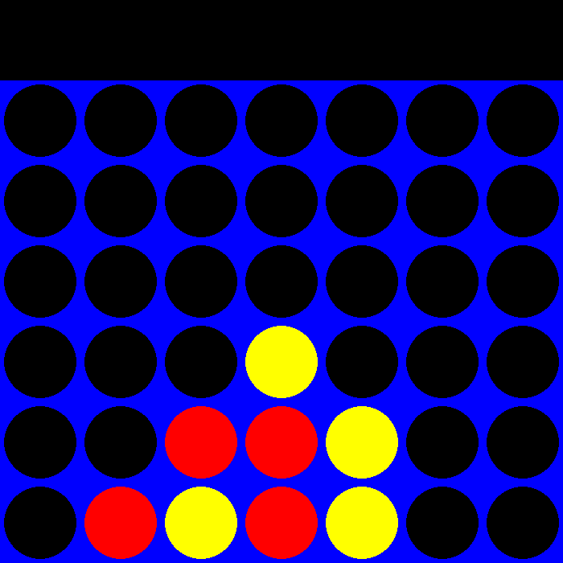

# Connect 4

**A playable study of adversarial search.**

Drop a piece, plan ahead, and play against a Minimax opponent. This Python desktop game pairs a six-by-seven board with a Pygame interface and Alpha-Beta pruning.

`Python` · `pygame-ce` · `NumPy` · `Minimax`

[Run locally](#run-locally) · [How the AI works](#how-the-ai-works) · [Code map](#code-map)

---

<p align="center">
  
</p>

*Illustrative board position rendered with this repository's own drawing code.*

## The game

- Play as **red** against the **yellow** AI.
- Move the mouse to choose a column; click to drop a piece.
- Connect four pieces horizontally, vertically, or diagonally.
- The starting player is chosen randomly.
- The AI searches **five plies** ahead in the current configuration.

## Run locally

Requires Python 3, `pip`, and a desktop display.

```bash
git clone https://github.com/Mohamed-Saeed-Hussein/Connect-4.git
cd Connect-4
python3 -m venv .venv
source .venv/bin/activate
python -m pip install pygame-ce numpy
python main.py
```

On Windows, create the environment with `py -m venv .venv` and activate it with `.venv\Scripts\Activate.ps1` in PowerShell.

Close the game window to exit. After a win, the result is displayed briefly before the program ends; run it again for another match.

## How the AI works

| Stage | Implementation |
| :--- | :--- |
| Generate moves | Consider columns with at least one free cell. |
| Simulate | Copy the board and place a piece for the current side. |
| Search | Alternate maximizing AI turns and minimizing player turns. |
| Prune | Stop exploring a branch when Alpha-Beta bounds make it irrelevant. |
| Evaluate | Prefer center control and promising groups of four; penalize immediate opponent threats. |

The depth is set in the `minimax(board, 5, ...)` call in [main.py](main.py). Increasing it expands the search and can make the interface wait longer between turns.

## Code map

| File | Responsibility |
| :--- | :--- |
| [main.py](main.py) | Event loop, turn order, and AI invocation |
| [board.py](board.py) | Board state, legal moves, and win detection |
| [ai.py](ai.py) | Minimax, Alpha-Beta pruning, and position scoring |
| [gui.py](gui.py) | Board rendering and winner display |
| [constants.py](constants.py) | Dimensions, colors, and player identifiers |

## Current boundaries

The search runs synchronously, and there is no in-game restart or difficulty menu. The main loop does not yet handle a full-board draw cleanly, although the search recognizes terminal draw positions.

These are useful next steps for the game; the current focus is understanding the search and board logic.
